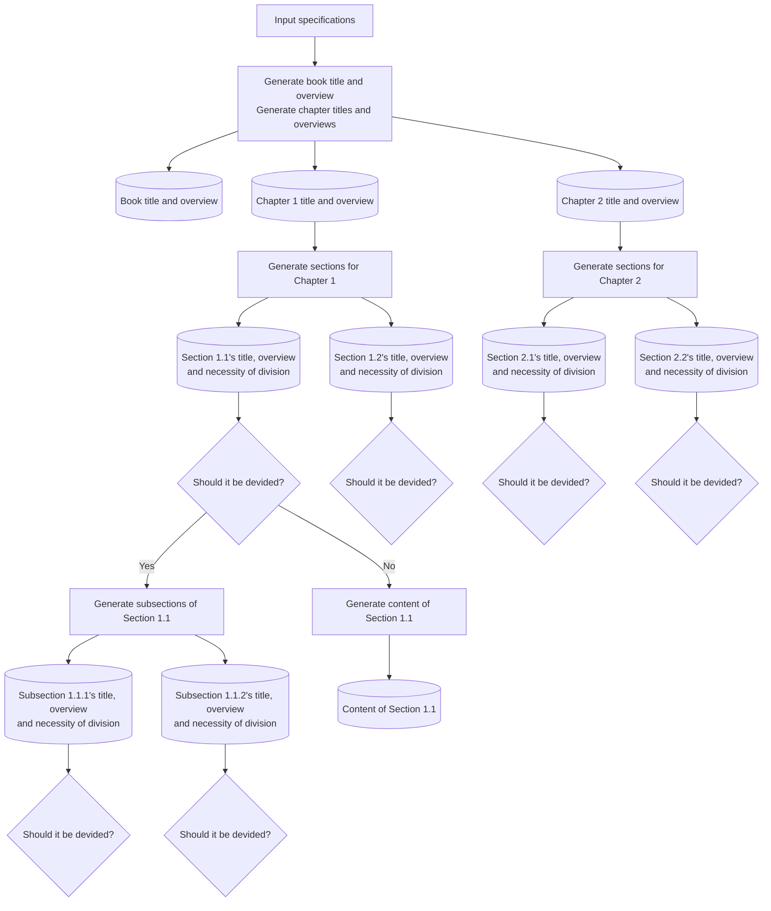

# AutoGenBook
AutoGenBook is a Python-based tool that automatically generates books using LLMs. It creates chapters, sections, and subsections recursively based on user-defined content and outputs the final book as a PDF using LaTeX.

## How to Use

### Getting and Setting Up the OpenAI API Key

This tool requires an OpenAI API key. Once you obtain the API key, click on the key icon on the left-hand menu in Google Colab and register it with the name `openai_api`.

### Running the Tool on Google Colab

Click the button below to open the tool in Google Colab:

日本語で使用したい場合は以下のGoogle Colabを利用してください．

## What’s Inside AutoGenBook

While you can dive into the code for all the details, I realize that it might be a bit hard to follow, so let me explain the basic idea and workflow behind the tool.

### Overview

Since ChatGPT has limitations on how much text it can generate at once, simply asking it to “write a textbook” results in only 1-2 pages of content. To overcome this, AutoGenBook recursively breaks down the structure of a book starting from the main topic or title. It goes from chapters → sections → subsections, and so on. This approach ensures that ChatGPT can generate meaningful, self-contained book for you without hitting its output limit.

Finally, the content for each subdivided section is generated using ChatGPT, and then output as a PDF.

### Workflow

Here’s an outline of the process. I've simplified it by only showing the flow up to the creation of subsections, but the same recursive structure continues for deeper levels.

