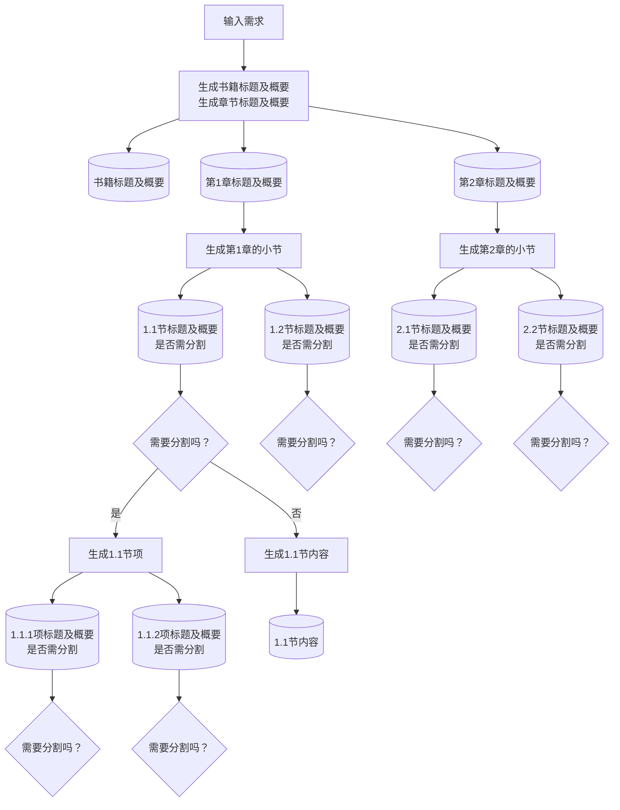

# AutoGenBook
AutoGenBook 是一个基于 Python 的工具，使用 LLM（大型语言模型）自动生成书籍。根据用户指定的内容，递归地生成章节、小节，并最终通过 LaTeX 以 PDF 格式输出。

## 使用方法

### 获取和设置 OpenAI API 密钥

此工具需要 OpenAI 的 API 密钥。获取密钥后，请点击 Google Colab 左侧菜单中的钥匙图标，并以 `openai_api` 的名称注册。

### 在 Google Colab 上运行工具

点击以下按钮在 Google Colab 上打开工具：

## 教科书示例

可以在这里以 PDF 格式查看生成的教科书示例“线性代数与机器学习：从理论到实践”：

[前往Google Drive](https://drive.google.com/file/d/1n3lnKkex9fLdmMoXYENnE52Au0XH9dkz/view?usp=sharing)

## AutoGenBook 的内容

尽管详细内容可在程序中查看，但以下是简单的想法和处理流程。

### 基本思路

由于 ChatGPT 的输出量有限，即使请求“生成教科书”，也只能输出 1-2 页的内容。因此，以书的主题或标题为起点，递归地将其划分为大标题（章）、中标题（节）、小标题（项）等独立部分。这种方法使得我们可以在不受 ChatGPT 输出量限制的情况下自动生成书的整体结构。最终，每个小区块的内容将通过 ChatGPT 生成并以 PDF 格式输出。

这种方法类似于人在编写书籍或论文时，先制定章节结构再开始实际撰写内容，属于自然的思路。

### 处理流程

下图展示了大致的处理流程，其中部分相同的步骤已省略，且分割流程仅至小标题的生成为止。

### 实际生成的文本结构

以下是实际输出的约 12 页书籍的文本结构。箭头从 book 指向的 1、2、3、4 表示章节，其下方为小节，再下方为小标题。这些节点包含章节和小节的标题及概要信息。用红色圆点表示的末端节点则包含正文内容信息。
