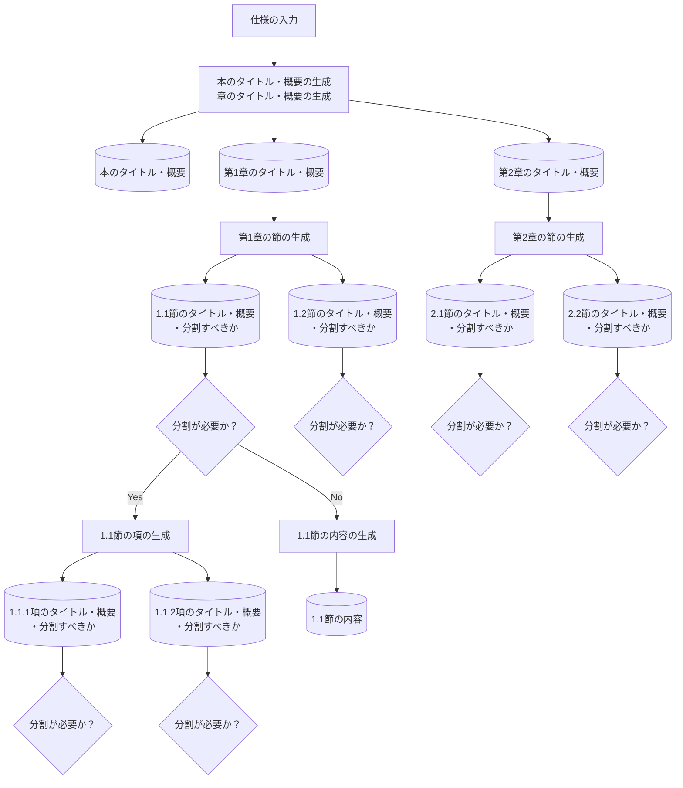

# AutoGenBook
AutoGenBookは、LLM（大規模言語モデル）を用いて本を自動生成するPythonベースのツールです。ユーザーが指定した内容に基づき、章や節、さらに小節を再帰的に作成し、最終的にLaTeXを使用してPDF形式で出力します。

## 使用方法

### OpenAI APIキーの取得と設定

このツールはOpenAIのAPIキーを必要とします。APIキーを取得したら、Google Colabの左側のメニューにあるキーアイコンをクリックし、`openai_api`という名前で登録してください。

### Google Colabでのツールの実行

以下のボタンをクリックして、Google Colabでツールを開きます：

## サンプル教科書

生成された教科書のサンプル「機械学習のための線形代数：Numpyによる実践ガイド」をPDF形式でこちらから閲覧できます：

[Google Driveに飛びます](リンクはこちらに)

## AutoGenBookの中身

詳細はプログラムの内容を見てもらえばわかると思いますが、簡単にアイデアと処理の流れを説明します。

### 基本アイデア

ChatGPTには出力量に制限があるため、「教科書を作ってほしい」と頼んでも、1〜2ページ程度の内容しか出力されません。
そこで、ある本の主題・タイトルを起点として、大見出し（章）→中見出し（節）→小見出し（項）→...のように、ChatGPTを用いて意味的に独立した区分に再帰的に分割します。
これにより、本の全体構成をChatGPTの出力量に縛られることなく自動生成することができます。
そして、最終的に分割された各小区分に関する本文の内容をChatGPTによって生成し、PDFとして出力します。

これは人が本や論文を書く時に、章立てを考えてから実際に中身を書き始めるのと同じで、発想としては自然なことだと思います。

### 処理の流れ

以下に、おおまかな処理の流れを示します。同じ処理を行うところは一部省略しています。
また、項の生成までで止めていますが、それ以降の分割処理は続きます。

### 実際に作成された文章構造

実際に出力された12ページくらいの本の文章構造を以下に示します。
bookから出ている矢印の先の１、２、３、４が章を表していて、その下が節、その下が小節になっています。これらのノードは、その章・節のタイトルや概要を情報として持っています。
そして、赤い丸で示されている末端のノードは、本文の内容を情報として持っているノードになります。
