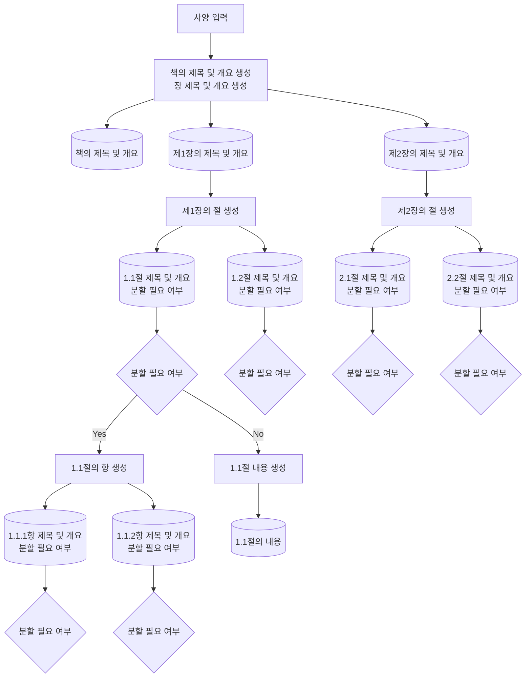

# AutoGenBook
AutoGenBook은 LLM(대규모 언어 모델)을 사용하여 책을 자동으로 생성하는 Python 기반 도구입니다. 사용자가 지정한 내용에 따라 장, 절, 더 나아가 소절을 재귀적으로 생성하며, 최종적으로 LaTeX를 사용하여 PDF 형식으로 출력합니다.

## 사용 방법

### OpenAI API 키의 획득 및 설정

이 도구는 OpenAI의 API 키가 필요합니다. API 키를 획득한 후, Google Colab의 왼쪽 메뉴에 있는 키 아이콘을 클릭하고 `openai_api`라는 이름으로 등록하세요.

### Google Colab에서 도구 실행

아래 버튼을 클릭하여 Google Colab에서 도구를 여세요：

## 샘플 교과서

생성된 교과서 샘플 "기계 학습을 위한 선형 대수학: Numpy로 배우는 실전 가이드"를 PDF 형식으로 여기서 확인할 수 있습니다：

[Google Drive로 이동](https://drive.google.com/file/d/1KudNpRv7AnPx7ympcGfBSiaB3SJTHk0u/view?usp=sharing)

## AutoGenBook의 구성

프로그램 내용을 보시면 더 자세히 이해할 수 있겠지만, 간단하게 아이디어와 처리 흐름을 설명합니다.

### 기본 아이디어

ChatGPT에는 출력 용량 제한이 있어 "교과서를 만들어 주세요"라고 요청하더라도 1~2페이지 정도의 내용만 출력됩니다.
이에 따라 특정 주제나 제목을 시작점으로, 대제목(장) → 중제목(절) → 소제목(항) → ...와 같이 ChatGPT를 이용해 의미적으로 독립된 구간으로 재귀적으로 나눕니다.
이로써 책의 전체 구성을 ChatGPT의 출력 용량에 구애받지 않고 자동으로 생성할 수 있습니다.
그리고, 최종적으로 나누어진 각 소구간의 본문 내용을 ChatGPT가 생성하여 PDF로 출력합니다.

이 방법은 사람이 책이나 논문을 작성할 때, 장을 구상한 후 실제로 내용을 작성하는 방식과 유사하여, 자연스러운 발상이라 생각됩니다.

### 처리 흐름

아래에 대략적인 처리 흐름을 표시합니다. 동일한 처리를 반복하는 부분은 일부 생략했으며, 항의 생성 단계까지만 표시하였지만 이후의 분할 처리도 계속됩니다.

### 실제로 생성된 문장 구조

실제로 출력된 약 12페이지 분량의 책의 문장 구조를 아래에 나타냅니다.
book에서 나오는 화살표의 끝에 있는 1, 2, 3, 4는 장을 나타내고, 그 아래는 절, 그 아래는 소절을 나타냅니다. 이 노드들은 해당 장, 절의 제목이나 개요 정보를 포함하고 있습니다.
그리고 빨간 원으로 표시된 끝 노드는 본문의 내용을 포함하고 있는 노드입니다.
